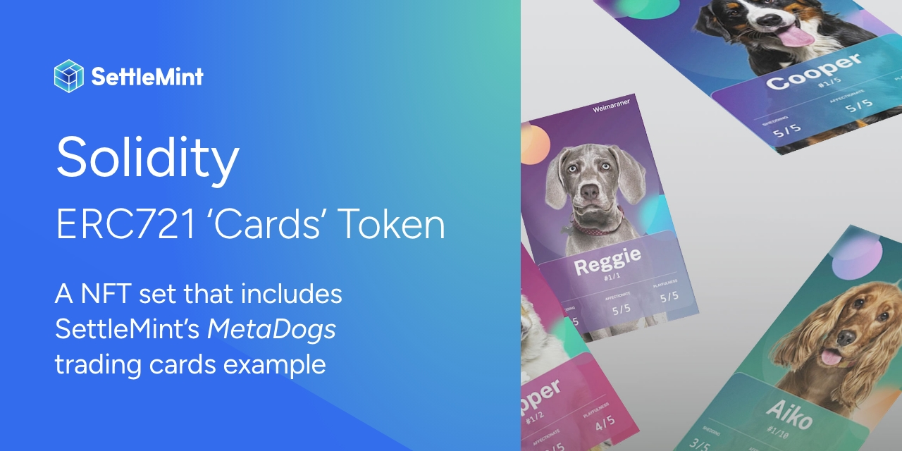

# ERC721 Trading Cards

A trading cards NFT example.

## Get started

Launch this smart contract set in the SettleMint Blockchain Transformation platform under the `Smart Contract Sets` section. This will automatically link it to your own blockchain node and make use of the private keys living in the platform.

If you want to use it separately, bootstrap a new project using

```shell
forge init my-erc721-token --template settlemint/solidity-token-erc721-cards
```

## DX: Foundry & Hardhat hybrid

**Foundry is a blazing fast, portable and modular toolkit for Ethereum application development written in Rust.**

Foundry consists of:

- **Forge**: Ethereum testing framework (like Truffle, Hardhat and DappTools).
- **Cast**: Swiss army knife for interacting with EVM smart contracts, sending transactions and getting chain data.
- **Anvil**: Local Ethereum node, akin to Ganache, Hardhat Network.
- **Chisel**: Fast, utilitarian, and verbose solidity REPL.

**Hardhat is a Flexible, Extensible, Fast Ethereum development environment for professionals in typescript**

Hardhat consists of:

- **Hardhat Runner**: Hardhat Runner is the main component you interact with when using Hardhat. It's a flexible and extensible task runner that helps you manage and automate the recurring tasks inherent to developing smart contracts and dApps.
- **Hardhat Ignition**: Declarative deployment system that enables you to deploy your smart contracts without navigating the mechanics of the deployment process.
- **Hardhat Network**: Declarative deployment system that enables you to deploy your smart contracts without navigating the mechanics of the deployment process.

## Documentation

- <https://console.settlemint.com/documentation/docs/using-platform/integrated-development-environment/>
- <https://book.getfoundry.sh/>

## Usage

### Build

You can either use Forge:

```shell
btp-scs foundry build
```

or Hardhat:

```shell
btp-scs hardhat build
```

### Test

With Forge:

```shell
btp-scs foundry test
```

or Hardhat:

```shell
btp-scs hardhat test
```

### Format

To format your contracts, run

```shell
btp-scs foundry format
```

### Deploy to platform network

Trading cards are generated using Canvas. You can check the asset folder and set your own images in there to build your NFT assets.

1. To deploy the smart contract and set the sale stage, we are using Hardhat scripts.

```shell
btp-scs hardhat script remote -s <DEPLOYMENT_SCRIPT> (e.g. scripts/deploy.ts)
```

2. Collect any reserved tokens:

```shell
btp-scs hardhat script remote -s <COLLECT_RESERVED>
```

3. Generate the merke tree of whitelisted addresses:

```shell
btp-scs hardhat script remote -s <WHITELIST>
```

4. Start the presale:

```shell
btp-scs hardhat script remote -s <PRESALE>
```

5. Start the public sale:

```shell
btp-scs hardhat script remote -s <PUBLIC_SALE>
```

6. Reveal tokens:

```shell
btp-scs hardhat script remote -s <REVEAL>
```

### Deploy your subgraph

To index your smart contract events, use The Graph middleware.
First, edit `subgraph.config.json` to set the addresses of your smart contracts. You can find them in the deployment folder created under `ignation`. Then, run:

```shell
btp-scs subgraph codegen
```

```shell
btp-scs subgraph build
```

```shell
btp-scs subgraph deploy
```

### Help

To get info about the tasks, run:

```shell
btp-scs --help
forge --help
anvil --help
cast --help
```
